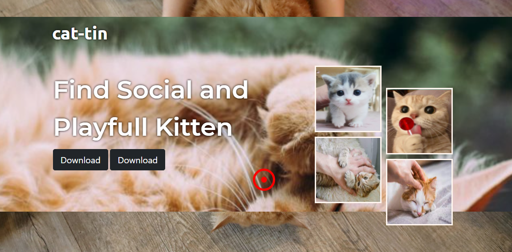
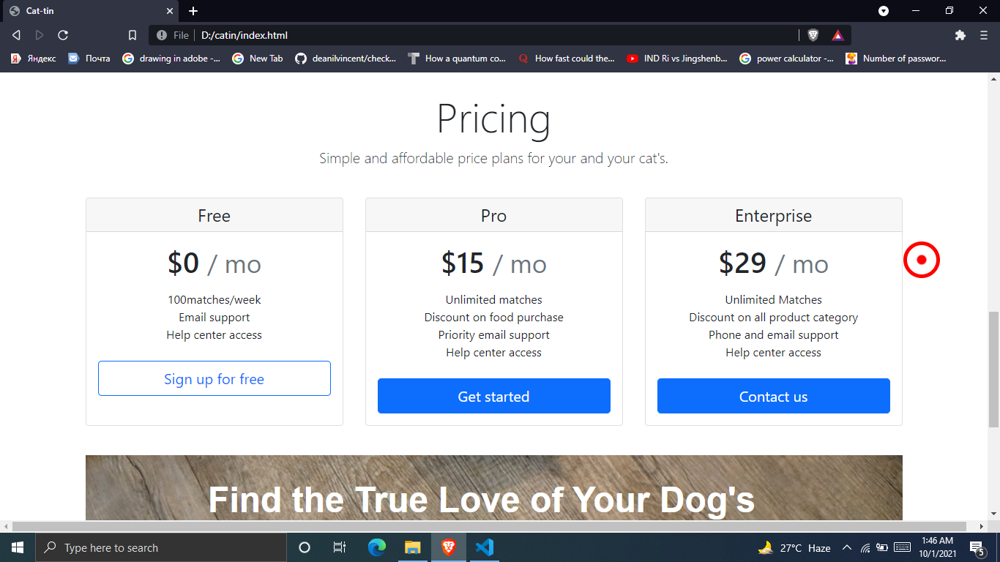

#CATIN Site
 ## intro section
 this the github repo for for understanding html and css only 
 * I-had created a webpage for an app named cat-tin more likely cat + tinder. This company has its own app where user can find the most cutes cat nearby and buy some other products also.
 
 ## features section
 * 1-cat-toin aap has many features where user can serch cat near them and find a mathch 
 * 2-User can search for different breeds as accourdin to choice.
 * 3- user can also buy food suplement for cats
 * 4- weakly doctor health advise through video call is also available. this all features have image hover effect amd sue to this it save extra save and add more styling in css...
 
 ## Pricing section
 *this page also includes pricing tags so that user selet the plan according then requirement where special offer and discpound on purchase is given  user can find different servise caegory by seleting our service plans.
 
 ## footer section
 * this website have a aswesome footer section where it contain the comany socila media accound and also the github page link for this website...
 

